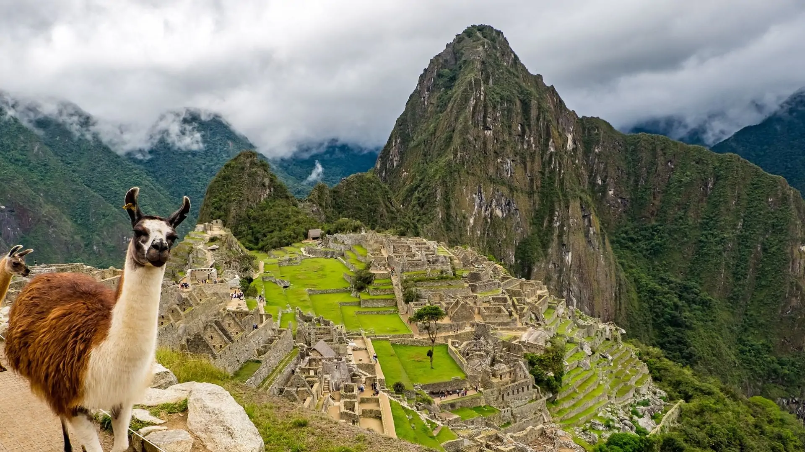

# Tourism in Peru

Peru is a beautiful country in South America with rich history and amazing landscapes.

## Famous Tourist Attractions

- [Machu Picchu](machu.md)
- [Lake Titicaca](titicaca.md)


---
layout: default
title: "Tourism in Peru"
---

# Tourism in Peru

Peru is a beautiful country in South America with a rich history and amazing landscapes.

- [Machu Picchu](machu.md)
- [Lake Titicaca](titicaca.md)


```md

- Arequipa
- Lima
- Tacna
´´´
